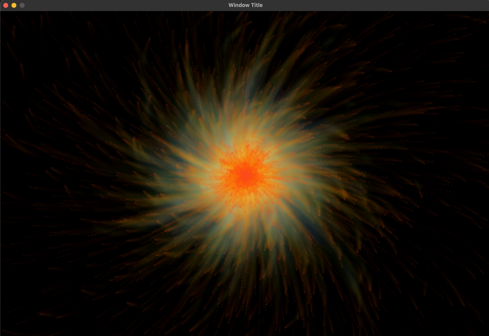

This is a particle fire program with individual pixel behavior (think pretty screensaver) written with C++ using SDL2. All credit goes to John@caveofprogramming.com. This was my first C++ projcet. To run, you will need to compile on your local machine using the SDL2 https://wiki.libsdl.org/Installation libraries. I had a pretty rough time doing this on my Mac and have since started using Ubuntu for my C++ development environment which has gone much more smoothly. Here is a link to the free course for this code: https://www.udemy.com/course/free-learn-c-tutorial-beginners/?src=sac&kw=C%2B%2B+for+compl